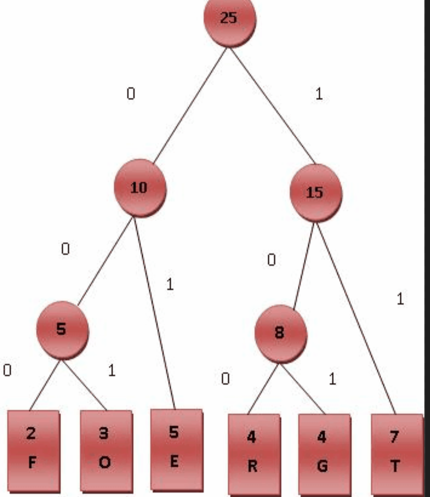

# Huffman Tree

## 基本实现
- 对于字符串等，根据字符的出现频率不同，设定不同的编码规则；对高频字符，采用较短的编码；从而实现文本的压缩；
- 使用Trie树，记录下每个节点的字符值，频率值；低频的在叶子节点；高频的在根节点；
- 此外边赋值；左节点赋值0，右节点统一赋值1；频率值由子节点相加得到，如下图所示:


## 代码实现：
```python
import sys

class Letter:
    def __init__(self, letter, freq):
        self.letter = letter
        self.freq = freq
        self.bitstring = ""

    def __repr__(self):
        return f"{self.letter}:{self.freq}"


class TreeNode:
    def __init__(self, freq, left, right):
        self.freq = freq
        self.left = left
        self.right = right


def parse_file(file_path):
    """
    Read the file and build a dict of all letters and their
    frequencies, then convert the dict into a list of Letters.
    """
    chars = {}
    with open(file_path) as f:
        while True:
            c = f.read(1)
            if not c:
                break
            chars[c] = chars[c] + 1 if c in chars.keys() else 1
    return sorted([Letter(c, f) for c, f in chars.items()], key=lambda l: l.freq)


def build_tree(letters):
    """
    Run through the list of Letters and build the min heap
    for the Huffman Tree.
    """
    while len(letters) > 1:
        left = letters.pop(0)
        right = letters.pop(0)
        total_freq = left.freq + right.freq
        node = TreeNode(total_freq, left, right)
        letters.append(node)
        letters.sort(key=lambda l: l.freq)
    return letters[0]


def traverse_tree(root, bitstring):
    """
    Recursively traverse the Huffman Tree to set each
    Letter's bitstring, and return the list of Letters
    """
    if type(root) is Letter:
        root.bitstring = bitstring
        return [root]
    letters = []
    letters += traverse_tree(root.left, bitstring + "0")
    letters += traverse_tree(root.right, bitstring + "1")
    return letters


def huffman(file_path):
    """
    Parse the file, build the tree, then run through the file
    again, using the list of Letters to find and print out the
    bitstring for each letter.
    """
    #频次表--获取文件中字符串，每个字符的频率值，并排序好：
    letters_list = parse_file(file_path)
    #层级数--由下往上构建整个频次树，频次不断累加；最后返回根节点，下联所有子节点：
    root = build_tree(letters_list)
    #树编码--遍历频次树，进行编码；左节点加0，右节点加1；由顶到底，编码位数逐层递增:
    letters = traverse_tree(root, "")
    #字符编码--根据上方得到的字典树，对文本中的所有字符编码，即得到压缩的效果
    print(f"Huffman Coding of {file_path}: ")
    with open(file_path) as f:
        while True:
            c = f.read(1)
            if not c:
                break
            le = list(filter(lambda l: l.letter == c, letters))[0]
            print(le.bitstring, end=" ")
    print()


if __name__ == "__main__":
    # pass the file path to the huffman function
    huffman(sys.argv[1])
```

## TODO Java版本实现