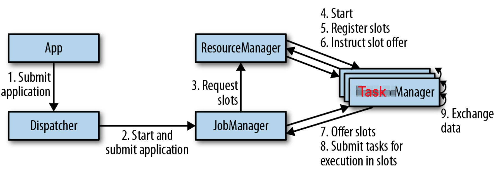
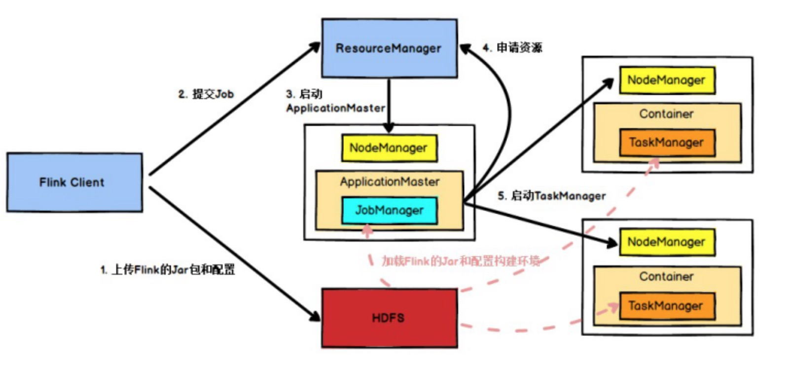
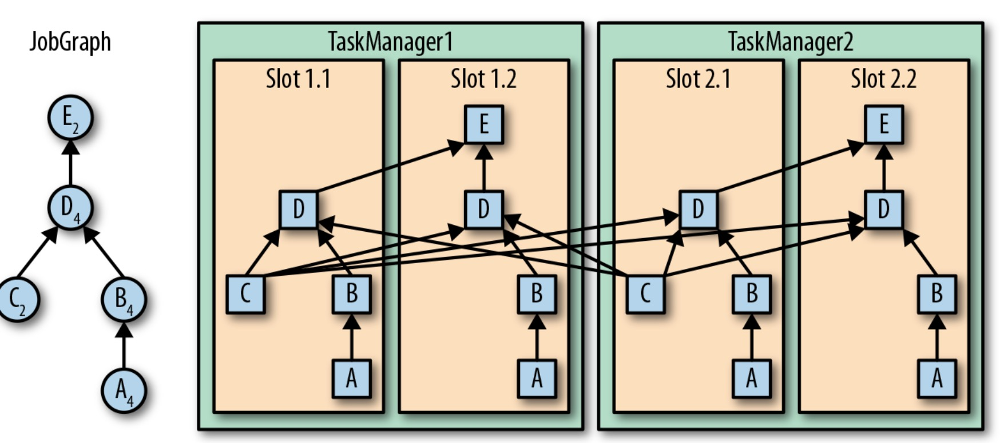

## 安装入门和word count参考
https://blog.csdn.net/xichengqc/article/details/91492481

## batch word count代码
```scala
import org.apache.flink.api.scala.ExecutionEnvironment
import org.apache.flink.core.fs.FileSystem

object BatchWordCount {

  def main(args: Array[String]): Unit = {
    val inputPath = "/Users/xx/Downloads/flink_in"
    val outputPath = "/Users/xx/Downloads/out"
    val env:ExecutionEnvironment = ExecutionEnvironment.getExecutionEnvironment
    val text = env.readTextFile(inputPath)

    import org.apache.flink.api.scala._
    val windowCounts = text.flatMap{_.split("\\W+")}
      .filter(_.nonEmpty)
      .map((_,1))
      .groupBy(0)
      .sum(1)
    windowCounts.writeAsCsv(outputPath,"\n",",",FileSystem.WriteMode.OVERWRITE).setParallelism(1)
    env.execute("batch wc job")
  }
}
```

## streaming word count代码
```scala
package com.bigdata.flink

import org.apache.flink.api.java.utils.ParameterTool
import org.apache.flink.runtime.state.filesystem.FsStateBackend
import org.apache.flink.streaming.api.scala.StreamExecutionEnvironment
import org.apache.flink.streaming.api.windowing.time.Time

object SocketWindowWordCount {

  def main(args: Array[String]): Unit = {
    val port:Int = try {
      ParameterTool.fromArgs(args).getInt("port")
    }catch{
      case e : Exception => {
        System.out.println("no input port,use default port:9000")
      }
        9000
    }
    val env:StreamExecutionEnvironment = StreamExecutionEnvironment.getExecutionEnvironment
    val text = env.socketTextStream("localhost",port,'\n')

    import org.apache.flink.api.scala._
//    env.setStateBackend(new FsStateBackend(""))

    text.flatMap(line => line.split("\\s"))
        .map(line => (line,1)).keyBy(0)
      .timeWindow(Time.seconds(3)).sum(1)
      .print().setParallelism(1)

//    text.flatMap(line => line.split("\\s"))
//      .map(line => (line,1)).keyBy(0).countWindow(1000)

    env.execute("socket window wc job")
  }

  case class WordCount(word:String,count:Long)
}
```

## source读取
- flink读取kafka数据源的代码
```scala
object KafkaRead {
  private val logger: Logger = LoggerFactory.getLogger("KafkaRead")

  def main(args: Array[String]): Unit = {
    val env: StreamExecutionEnvironment = StreamExecutionEnvironment.getExecutionEnvironment
    val properties = new Properties()
    properties.setProperty("bootstrap.servers","xx-master:9092,xx-service:9092")
    properties.setProperty("group.id","flink_grp")

    import org.apache.flink.api.scala._

    val kafkaCus = new FlinkKafkaConsumer[String]("kafka-action",new SimpleStringSchema(),properties)
    val stream: DataStream[String] = env.addSource(kafkaCus)
    stream.print()

    env.execute("flink read from kafka")
  }
}
```

## DataStream API
### Transform分类
转换算子分成四类：
- 基本转换算子：将会作用在数据流中的每一条单独的数据上。如，map/filter/flatmap
- KeyedStream转换算子：在数据有key的情况下，对数据应用转换算子。如，增量更新max min和通用的reduce操作
- 多流转换算子：合并多条流为一条流或者将一条流分割为多条流。如，
union: 合并两个流，FIFO，但不保证顺序，也不会去重；
connect: 连接两个流，ConnectedStreams，使用CoMapFunction对两个流分别使用两个方法；
split: 分流，不推荐；
- 分布式转换算子：将重新组织流里面的事件。
1. 物理分区
- Random 主要随机分区shuffle
- Round-Robin 使用Round-Robin负载均衡算法将输入流平均分配到随后的并行运行的任务中
- Rescale 解决数据倾斜的 rabalance，该算子会通过网络传输数据，获得分区的平衡；对应的rescale只是进行算子建平衡，不会通过网络进行数据拷贝
- Broadcast 和spark类似进行小表的广播
- Custom 自定义分区的例子:
```scala
    val sds: DataStream[String] = env.fromElements("one two three four third-2","third-1 third-3")
    sds.flatMap(st => st.split(" ")).map(x => (x,1)).partitionCustom(new ContainPartition,0).print()
```
实现分区类逻辑:
```scala
class ContainPartition extends Partitioner[String]{
  override def partition(k: String, i: Int): Int = {
    if (k.contains("third")){
      0
    }else{
      1
    }
  }
}
```
例子的结果如下:
> 1> (third-1,1)
1> (third-3,1)
1> (third-2,1)
2> (one,1)
2> (two,1)
2> (three,1)
2> (four,1)
可以看到通过自定义分区，将包含third的数据落在分区1；其他的落在分区2；这样的处理对于分区根据业务不同的调整划分非常有效。

2. Transform相关例子
```scala
object StreamTransform {
  def main(args: Array[String]): Unit = {
    val env: StreamExecutionEnvironment = StreamExecutionEnvironment.getExecutionEnvironment

    //key by transform
    val ds: DataStream[(Int, Double)] = env.fromElements((1,1.0),(1,2.0),(2,3.3),(3,12.5))

    //aggregation sum function(min max and so on)
    val ks: DataStream[(Int, Double)] = ds.keyBy(0).sum(1)
    ks.print()

    //reduce function
    val rs = ds.keyBy(0).reduce((x1,x2) => (x1._1, x1._2 + x2._2))
    rs.print()

    env.execute("transform for stream")
  }
}
```
- 简单的map flatmap filter算子
- 聚合相关的 keyBy，aggregation算子(sum,max,min)等
- 相对应预keyBy获取分组数据，reduce算子直接进行reduce归约运算

3. UDF函数
FilterFunction
Lambda函数
Rich Function

## 处理流数据
### 并行度
算子的并行度可以在执行环境这个层级来控制，也可以针对每个不同的算子设置不同的并行度。默认情况下，应用程序中所有算子的并行度都将设置为执行环境的并行度
可以以不同方式利用数据流图中的并行性。
第一，我们可以对输入数据进行**分区**，并在数据的子集上并行执行具有相同算子的任务并行。这种类型的并行性被称为数据并行性。数据并行是有用的，因为它允许处理大量数据，并将计算分散到不同的计算节点上。
第二，我们可以将**不同的算子**在相同或不同的数据上并行执行。这种并行性称为任务并行性。使用任务并行性，我们可以更好地利用计算资源。

- 对于第一点，数据交换策略的设定：
前向策略 将数据从一个任务发送到接收任务。如果两个任务都位于同一台物理计算机上（这通常由任务调度器确保），这种交换策略可以避免网络通信。
广播策略 将所有数据发送到算子的所有的并行任务上面去。因为这种策略会复制数据和涉及网络通信，所以代价相当昂贵。
基于键控的策略 通过Key值(键)对数据进行分区保证具有相同Key的数据将由同一任务处理。
随机策略 统一将数据分配到算子的任务中去，以便均匀地将负载分配到不同的计算任务。

### 各组件图
在流处理中，窗口操作与两个主要概念密切相关：时间语义和状态管理。

Flink运行时架构主要包括四个不同的组件，它们会在运行流处理应用程序时协同工作：作业管理器（JobManager）、资源管理器（ResourceManager）、任务管理器（TaskManager），以及分发器（Dispatcher）。因为Flink是用Java和Scala实现的，所以所有组件都会运行在Java虚拟机（JVMs）上。每个组件的职责如下：

1. 作业管理器（JobManager）是控制一个应用程序执行的主进程，也就是说，每个应用程序都会被一个不同的JobManager所控制执行。JobManager会先接收到要执行的应用程序。这个应用程序会包括：作业图（JobGraph）、逻辑数据流图（logical dataflow graph）和打包了所有的类、库和其它资源的JAR包。JobManager会把JobGraph转换成一个物理层面的数据流图，这个图被叫做“执行图”（ExecutionGraph），包含了所有可以并发执行的任务。JobManager会向资源管理器（ResourceManager）请求执行任务必要的资源，也就是任务管理器（TaskManager）上的插槽（slot）。一旦它获取到了足够的资源，就会将执行图分发到真正运行它们的TaskManager上。而在运行过程中，JobManager会负责所有需要中央协调的操作，比如说检查点（checkpoints）的协调。
2. ResourceManager主要负责管理任务管理器（TaskManager）的插槽（slot），TaskManger插槽是Flink中定义的处理资源单元。Flink为不同的环境和资源管理工具提供了不同资源管理器（ResourceManager），比如YARN、Mesos、K8s，以及standalone部署。当JobManager申请插槽资源时，ResourceManager会将有空闲插槽的TaskManager分配给JobManager。如果ResourceManager没有足够的插槽来满足JobManager的请求，它还可以向资源提供平台发起会话，以提供启动TaskManager进程的容器。另外，ResourceManager还负责终止空闲的TaskManager，释放计算资源。
3. 任务管理器（TaskManager）是Flink中的工作进程。通常在Flink中会有多个TaskManager运行，每一个TaskManager都包含了一定数量的插槽（slots）。插槽的数量限制了TaskManager能够执行的任务数量。启动之后，TaskManager会向资源管理器注册它的插槽；收到资源管理器的指令后，TaskManager就会将一个或者多个插槽提供给JobManager调用。JobManager就可以向插槽分配任务（tasks）来执行了。在执行过程中，一个TaskManager可以跟其它运行同一应用程序的TaskManager交换数据。
4. 分发器（Dispatcher）可以跨作业运行，它为应用提交提供了REST接口。当一个应用被提交执行时，分发器就会启动并将应用移交给一个JobManager。



- YARN下的运行流程


1. Flink 任务提交后， Client 向 HDFS 上传 Flink 的 Jar 包和配置， 之后向 Yarn ResourceManager 提交任务， 
2. ResourceManager 分配 Container 资源并通知对应的NodeManager 启动 ApplicationMaster， 
3. ApplicationMaster 启动后加载 Flink 的 Jar 包和配置构建环境，然后启动 JobManager(Flink)，
4. 之后 ApplicationMaster 向 ResourceManager 申请资源启动 TaskManager ， 
5. ResourceManager 分配 Container 资 源 后 ， 由ApplicationMaster 通 知 资 源 所 在 节 点 的 NodeManager 启动 TaskManager(Flink) ，
6. NodeManager 加载 Flink 的 Jar 包和配置构建环境并启动 TaskManager，
7. TaskManager 启动后向 JobManager 发送心跳包， 并等待 JobManager 向其分配任务。

**汇总流程**: 
Flink Client -> Resource Manager(启动NM) -> Node Manager -> 启动Application Master -> Flink Job Manager -> Resource Manager(申请资源) -> Application Master获取到Container资源 -> 通知Node Manager启动Flink Task Manager -> 启动任务，保持心跳，完成任务

### Task Slot策略


- 最左边是一个“作业图”（JobGraph），包含了5个算子——它是应用程序的非并行表示。
其中算子A和C是数据源（source），E是输出端（sink）。
C和E并行度为2，而其他的算子并行度为4。
因为最高的并行度是4，所以应用需要至少四个slot来执行任务。
现在有两个TaskManager，每个又各有两个slot，所以我们的需求是满足的。
JobManager将JobGraph转化为“执行图”（ExecutionGraph），并将任务分配到四个可用的slot上。
对于有4个并行任务的算子，它的task会分配到每个slot上。
而对于并行度为2的operator C和E，它们的任务被分配到slot 1.1、2.1 以及 slot 1.2、2.2。
将tasks调度到slots上，可以让多个tasks跑在同一个TaskManager内，也就可以是的tasks之间的数据交换更高效。

slot 目前仅仅用来隔离 task 的受管理的内存。

### 数据传输
TaskManager的网络组件会在缓冲区中收集数据，然后再将其发送，也就是说，数据不是逐条发送的，而是在缓冲区中“攒”成了一批。
这种技术是有效利用网络资源和实现高吞吐量的基础，机制类似于网络或磁盘I/O协议中使用的缓冲技术。

通过缓冲区来传递数据，意味着Flink的处理模型是基于微批的。

## 任务链和资源组
为了满足任务链的要求，必须将两个或多个算子设为**相同的并行度**，并通过本地转发（local forward）的方式进行连接。
以任务链方式运行，对于满足任务链的多个算子的函数被融合成了一个单一的任务，由一个线程执行。
由函数生成的数据通过一个简单的方法调用移交给下一个函数；
这样在函数之间直接传递数据，基本上没有序列化和通信成本。

- 主要对计算和存储资源尽可能在多个算子直接共用，这样数据无需多次网络拷贝，从而提高数据处理性能；
比如说，flink内部会对两个连续的map算子尽可能整合在一个计算资源里进行；
- startNewChain调取的算子开始创建为连续的任务链；disableChaining进行取消；
- slotSharingGroup进行存储资源slot共享组；多个子任务共用相同的slot数据，从而加快数据处理速度。

## 时间戳提取和水位线设置
### 水位线
任务会有一个内部的时间服务，它会维护定时器，并在收到watermark时触发。
任务可以在计时器服务中注册定时器，以便在将来特定的时间点执行计算。
例如，窗口算子为每个活动窗口注册一个定时器，当事件时间超过窗口的结束时间时，该计时器将清除窗口的状态。

- 水位线的更新
当任务收到watermark时，将执行以下操作：
任务根据watermark的时间戳更新其内部事件时钟。
任务的时间服务会将所有过期的计时器标识出来，它们的时间小于当前的事件时间。对于每个过期的计时器，任务调用一个回调函数，该函数可以执行计算并发送结果。
任务会发出一个带有更新后的事件时间的watermark。

- 多分区下的水位线获取
任务为每个输入分区维护一个分区水位线（watermark）。
当从一个分区接收到watermark时，它会比较新接收到的值和当前水位值，然后将相应的分区watermark更新为两者的最大值。
然后，任务会比较**所有分区**watermark的大小，将其事件时钟更新为所有分区watermark的**最小值**。
如果事件时间时钟前进了，任务就将处理所有被触发的定时器操作，并向所有连接的输出分区发送出相应的watermark，最终将新的事件时间**广播**给所有下游任务。

### 事件时间 EventTime
- 当水位线超过事件时间窗口的结束时间的时候，窗口将关闭，不再接收新事件，并触发计算。
- 时间戳分配器需要在source操作符后马上进行调用。
因为时间戳分配器看到的元素的顺序应该和source操作符产生数据的顺序是一样的，否则就乱了。
这就是为什么我们经常将source操作符的并行度设置为1的原因。
也就是说，任何分区操作都会将元素的顺序打乱，例如：并行度改变，keyBy()操作等等。
所以最佳实践是：在尽量接近数据源source操作符的地方分配时间戳和产生水位线，甚至最好在SourceFunction中分配时间戳和产生水位线。
当然在分配时间戳和产生水位线之前可以对流进行map和filter操作是没问题的，也就是说必须是窄依赖。

以下这种写法是可以的。

下面的例子展示了首先filter流，然后再分配时间戳和水位线。
```scala
val env = StreamExecutionEnvironment.getExecutionEnvironment
 
// 从调用时刻开始给env创建的每一个stream追加时间特征
env.setStreamTimeCharacteristic(TimeCharacteristic.EventTime)

val readings: DataStream[SensorReading] = env
  .addSource(new SensorSource)
  .filter(r => r.temperature > 25)
  .assignTimestampsAndWatermarks(new MyAssigner())
```

### 水位线的两种类型设置方式

1. AssignerWithPeriodicWatermarks 周期性的生成水位线
两个时间：一个触发时间间隔和触发后比较ts的逻辑。
- 触发时间
系统会周期性的将水位线插入到流中（水位线也是一种特殊的事件!）。
默认周期是200毫秒，也就是说，系统会每隔200毫秒就往流中插入一次水位线。
**这里的200毫秒是机器时间！**

可以使用ExecutionConfig.setAutoWatermarkInterval()方法进行设置。
// 每隔5秒产生一个水位线
env.getConfig.setAutoWatermarkInterval(5000)
每隔5秒钟，Flink会调用AssignerWithPeriodicWatermarks中的getCurrentWatermark()方法。

- ts max计算和水位比较逻辑
如果getCurrentWatermark()方法返回的时间戳大于0且大于之前水位线的时间戳，新的水位线会被插入到流中。
这个检查保证了水位线是单调递增的。
**插入新水位线就表示这个时间戳之前的数据都已到达，异常数据都到延迟数据集中**

例子，自定义一个周期性的时间戳抽取
```scala
class PeriodicAssigner
  extends AssignerWithPeriodicWatermarks[SensorReading] {
  val bound: Long = 60 * 1000 // 延时为1分钟
  var maxTs: Long = Long.MinValue + bound // 观察到的最大时间戳

  override def getCurrentWatermark: Watermark = {
    //AutoWatermarkInterval定义的时间间隔，每次调取判断；减去bound，即延迟1分钟时间后，为正值而且大于之前的水位线即返回插入新值。
    new Watermark(maxTs - bound)
  }

  override def extractTimestamp(r: SensorReading, previousTS: Long) = {
    //一直获取递增的ts
    maxTs = maxTs.max(r.timestamp)
    r.timestamp
  }
}
```

- 如果只是想用延迟一定时间的逻辑，可以直接简化继承BoundedOutOfOrdernessTimestampExtractor，传入超时时间参数即可；

2. AssignerWithPunctuatedWatermarks 标记水位线
该接口中的checkAndGetNextWatermark()方法会在针对每个事件的extractTimestamp()方法后立即调用。
它可以决定是否生成一个新的水位线。如果该方法返回一个非空、且大于之前值的水位线，算子就会将这个新水位线发出。
具体的一个例子:

```scala
class PunctuatedAssigner
  extends AssignerWithPunctuatedWatermarks[SensorReading] {
  val bound: Long = 60 * 1000

  // 每来一条数据就调用一次
  // 紧跟`extractTimestamp`函数调用
  override def checkAndGetNextWatermark(r: SensorReading,
                                        extractedTS: Long): Watermark = {
    if (r.id == "sensor_1") {
      // 抽取的时间戳 - 最大延迟时间
      new Watermark(extractedTS - bound)
    } else {
      null
    }
  }

  // 每来一条数据就调用一次
  override def extractTimestamp(r: SensorReading,
                                previousTS: Long): Long = {
    r.timestamp
  }
}
```

- 总之，使用水位线来**平衡延迟和计算正确性**两点，水位线的定义就是指出，在关闭窗口，
触发计算之前，需要等待事件的时长；基于事件时间的操作符根据水位线来衡量系统执行的**逻辑时间**进度。


## Process Function (Low-Level API) 
用于访问事件的时间戳信息和水位线信息和注册定时事件
Process Function用来构建**事件驱动**的应用以及实现自定义的业务逻辑(使用之前的window函数和转换算子无法实现)。

Flink提供了8个Process Function：
ProcessFunction
KeyedProcessFunction

ProcessWindowFunction
ProcessAllWindowFunction

CoProcessFunction
ProcessJoinFunction

BroadcastProcessFunction
KeyedBroadcastProcessFunction

### KeyedProcessFunction

1. KeyedProcessFunction[KEY, IN, OUT]还额外提供了两个方法:
processElement(v: IN, ctx: Context, out: Collector[OUT]), 流中的每一个元素都会调用这个方法，调用结果将会放在Collector数据类型中输出。
Context可以访问元素的时间戳，元素的key，以及TimerService时间服务。Context还可以将结果输出到别的流(side outputs)。

2. onTimer(timestamp: Long, ctx: OnTimerContext, out: Collector[OUT])是一个回调函数。
当之前注册的定时器触发时调用。参数timestamp为定时器所设定的触发的时间戳。Collector为输出结果的集合。
OnTimerContext和processElement的Context参数一样，提供了上下文的一些信息，例如firing trigger的时间信息(事件时间或者处理时间)。

- KeyedProcessFunction的实现的例子
1. 通过list state存储历史的登录失败事件，两秒钟内出现多次登录失败，即输出报警设置.

```scala
case class LoginEvent(userId:Long,ip: String,eventType:String,eventTime:Long)
case class Warning(userId:Long,firstFailTime: Long,lastFailTime:Long,warningMsg:String)

object LoginKeyedProcess {
  private val logger: Logger = LoggerFactory.getLogger("LoginKeyedProcess")

  def main(args: Array[String]): Unit = {
    val env: StreamExecutionEnvironment = StreamExecutionEnvironment.getExecutionEnvironment
    //设置时间类型参数
    env.setStreamTimeCharacteristic(TimeCharacteristic.EventTime)
    env.setParallelism(1)

    val resource: URL = getClass.getResource("/login.csv")
    val loginEventStream: DataStream[String] = env.readTextFile(resource.getPath)
    val warningStream = loginEventStream.map(data => {
      val dataArray: Array[String] = data.split(",")
      LoginEvent(dataArray(0).trim.toLong,dataArray(1),dataArray(2),dataArray(3).trim.toLong)
    })
      .assignTimestampsAndWatermarks(new BoundedOutOfOrdernessTimestampExtractor[LoginEvent](Time.seconds(5)) {
      override def extractTimestamp(element: LoginEvent): Long = element.eventTime * 1000
    })
      .keyBy(_.userId).process(new LoginFailAlertFunction(2))

    warningStream.print()
    env.execute("flink read from keyed")
  }
}

class LoginFailAlertFunction(maxFailTimes: Int) extends KeyedProcessFunction[Long,LoginEvent,Warning]{
  //记录历史fail的状态列表
  lazy val loginFailState: ListState[LoginEvent] =
    getRuntimeContext.getListState(new ListStateDescriptor[LoginEvent]("login-failed-state",classOf[LoginEvent]))

  override def processElement(value: LoginEvent,
                              ctx: KeyedProcessFunction[Long, LoginEvent, Warning]#Context,
                              out: Collector[Warning]): Unit = {
    //根据事件状态来区分逻辑
    if (value.eventType == "fail"){
      val iter: util.Iterator[LoginEvent] = loginFailState.get().iterator()
      if(iter.hasNext){
        //两秒内连续出现就报警
        val firstFail: LoginEvent = iter.next()
        if(value.eventTime - firstFail.eventTime <  2){
          out.collect(Warning(value.userId,firstFail.eventTime,value.eventTime,"login failed twice in 2 seconds."))
        }
        //重置更新最新一次的状态
        loginFailState.clear()
        loginFailState.add(value)
      }else{
        //第一次登陆，插入状态
        loginFailState.add(value)
      }
    }else{
      //成功登陆，清理状态
      loginFailState.clear()
    }
  }
}
```

## Ontimer TODO??


### WindowFunction
- 具体的使用办法:
stream
  .keyBy(...)
  .window(...)  // 指定window assigner
  .reduce/aggregate/process(...) // 指定window function
其中需要窗口assigner选择出来窗口内的数据和对于对于窗口内数据的处理的窗口函数

1. window assigner: 
水位线超过窗口结束时间，即触发窗口计算操作，包含：滚动窗口，滑动窗口，会话窗口;
其中，滑动窗口会出现数据的重叠；会话窗口不会数据的重叠，由于数据不连续，使用EventTimeSessionWindows.withGap(Time.minutes(15)设置不活动的时间间隔；

2. Window function类别:
window functions定义了窗口中数据的计算逻辑。
有两种计算逻辑：
- 增量聚合函数(Incremental aggregation functions)：
当一个事件被添加到窗口时，触发函数计算，并且更新window的状态(单个值)。最终聚合的结果将作为输出。
ReduceFunction和AggregateFunction是增量聚合函数。
ReduceFunction的例子:
```scala
  .keyBy(_._1)
  .timeWindow(Time.seconds(15))
  .reduce((r1, r2) => (r1._1, r1._2.min(r2._2)))
```
AggregateFunction的例子:
```scala
  .keyBy(_._1)
  .timeWindow(Time.seconds(15))
  .aggregate(new AvgTempFunction)
```

- 全窗口函数(Full window functions)：
这个函数将会收集窗口中所有的元素，可以做一些复杂计算;比如,ProcessWindowFunction。

3. Window function使用例子
一个用户行为信息计算的例子，后面包括了：
ReduceFunction求max；
AggregateFunction求平均值；
ProcessWindowFunction求window内的最值.

```scala
case class UserBehavior(timestamp: Long,userType:String,userName:String,userArea:String)

object UserAnalyseFromKafka {
  private val logger: Logger = LoggerFactory.getLogger("KafkaRead")

  def main(args: Array[String]): Unit = {
    val env: StreamExecutionEnvironment = StreamExecutionEnvironment.getExecutionEnvironment
    //设置时间类型参数
    env.setStreamTimeCharacteristic(TimeCharacteristic.EventTime)

    //设置kafka配置参数
    val properties = new Properties()
    properties.setProperty("bootstrap.servers","datateam-master:9092,datateam-service:9092")
    properties.setProperty("group.id","flink_grp")

    import org.apache.flink.api.scala._

    val kafkaCus = new FlinkKafkaConsumer[String]("kafka-action",new SimpleStringSchema(),properties)

    //设置超时数据记录
    val outTag = new OutputTag[UserBehavior]("late-data")

    val stream: DataStream[String] = env.addSource(kafkaCus)
    
    //获取producer生成的csv格式的数据，封装到UserBehavior，此外加入水位线
    val dataStream = stream.map(data => {
      val vals: Array[String] = data.split(",")
      UserBehavior(vals(0).toLong,vals(1),vals(2),vals(3))
      }).assignTimestampsAndWatermarks(new BoundedOutOfOrdernessTimestampExtractor[UserBehavior](Time.seconds(2)) {
      override def extractTimestamp(element: UserBehavior): Long = {
        element.timestamp
      }
    })

    //具体聚合算子-通过keyBy，将每分钟内的每区域的最新登录的用户过滤出来；
    //ReduceFunction和ProcessWindowFunction，分别实现最大值和获取对应用户信息记录
    val processedStream = dataStream.keyBy(_.userArea).timeWindow(Time.seconds(60))
        .sideOutputLateData(outTag)
        .reduce(new MaxReduceAgg(), new MaxProcessWindowFunction())

    processedStream.print()

    //获取延迟获取的SideOut数据
    val sideOutput = processedStream.getSideOutput(outTag)

    //延迟数据写入kafka的maxLog topic
    val outTopic = "maxLog"
    val outProp = new Properties()
    val boots = "datateam-master:9092,datateam-service:9092"
    outProp.setProperty("bootstrap.servers",boots)
    outProp.setProperty("transaction.timeout.ms",60000*15+"")

    val kafProducer = new FlinkKafkaProducer[String](
      outTopic,new SimpleStringSchema,
      outProp)

    sideOutput.map(uh => uh.userName + "\t" + uh.timestamp +"\t" + uh.userArea)
      .addSink(kafProducer)

    env.execute("flink read from kafka")
  }
}

class MaxProcessWindowFunction extends ProcessWindowFunction[UserBehavior,(String,Long),String,TimeWindow] {
  override def process(key: String, context: Context, elements: Iterable[UserBehavior], out: Collector[(String, Long)]): Unit = {
    val behavior: UserBehavior = elements.iterator.next()
    out.collect((behavior.userName,behavior.timestamp))
  }
}

class CountAgg extends AggregateFunction[UserBehavior,Long,Long]{
  override def createAccumulator(): Long = 0L

  override def add(in: UserBehavior, acc: Long): Long = acc + 1

  override def getResult(acc: Long): Long = acc

  override def merge(acc: Long, acc1: Long): Long = acc + acc1
}

class MaxReduceAgg extends ReduceFunction[UserBehavior]{
  override def reduce(r1: UserBehavior, r2: UserBehavior): UserBehavior = {if(r1.timestamp > r2.timestamp) r1 else r2}
}
```

4. ProcessWindowFunction组合使用场景
其中的process()方法接受的参数为：window的key，Iterable迭代器包含窗口的所有元素，Collector用于输出结果流。Context参数和别的process方法一样。
而ProcessWindowFunction的Context对象还可以访问window的元数据(**窗口开始和结束时间**)，当前处理时间和水位线，per-window state和per-key global state，side outputs。
将ReduceFunction/AggregateFunction和ProcessWindowFunction结合起来使用。ReduceFunction/AggregateFunction做增量聚合，ProcessWindowFunction提供更多的对数据流的访问权限。
一个和reduce组合的例子如下:
```scala
case class MinMaxTemp(id: String, min: Double, max: Double, endTs: Long)

val minMaxTempPerWindow2: DataStream[MinMaxTemp] = sensorData
  .map(r => (r.id, r.temperature, r.temperature))
  .keyBy(_._1)
  .timeWindow(Time.seconds(5))
  .reduce(
    (r1: (String, Double, Double), r2: (String, Double, Double)) => {
      (r1._1, r1._2.min(r2._2), r1._3.max(r2._3))
    },
    new AssignWindowEndProcessFunction()
  )

class AssignWindowEndProcessFunction
  extends ProcessWindowFunction[(String, Double, Double),
    MinMaxTemp, String, TimeWindow] {
  override def process(key: String,
                       ctx: Context,
                       minMaxIt: Iterable[(String, Double, Double)],
                       out: Collector[MinMaxTemp]): Unit = {
    val minMax = minMaxIt.head
    val windowEnd = ctx.window.getEnd
    out.collect(MinMaxTemp(key, minMax._2, minMax._3, windowEnd))
  }
}
```

5. 自定义窗口操作符
包括:
自定义窗口分配器
自定义窗口计算触发器(trigger)
自定义窗口数据清理功能(evictor)

- 当一个事件来到窗口操作符，首先将会传给WindowAssigner来处理。WindowAssigner决定了事件将被分配到哪些窗口。如果窗口不存在，WindowAssigner将会创建一个新的窗口。
- 如果一个window operator接受了一个增量聚合函数作为参数，例如ReduceFunction或者AggregateFunction，新到的元素将会立即被聚合，而聚合结果result将存储在window中。如果window operator没有使用增量聚合函数，那么新元素将被添加到ListState中，ListState中保存了所有分配给窗口的元素。
- 新元素被添加到窗口时，这个新元素同时也被传给了window的trigger。trigger定义了window何时准备好求值，何时window被清空。trigger可以基于window被分配的元素和注册的定时器来对窗口的所有元素求值或者在特定事件清空window中所有的元素。
- evictor是一个可选的组件，可以被注入到ProcessWindowFunction之前或者之后调用。evictor可以清除掉window中收集的元素。由于evictor需要迭代所有的元素，所以evictor只能使用在没有增量聚合函数作为参数的情况下。

代码示例：
stream
  .keyBy(...)
  .window(...)
 [.trigger(...)]
 [.evictor(...)]
  .reduce/aggregate/process(...)
注意：每个WindowAssigner都有一个默认的trigger。
- 详细示例可以参看官网

### 双流的Join
1. 基于时间间隔Join的例子
```scala
    val processStream = orderEventStream.intervalJoin(receiptEventStream)
      .between(Time.seconds(-5),Time.seconds(5))
      .process(new TxPayMatchByJoin())

    processStream.print()

    env.execute("tx pay match by join job")
```
```scala
class TxPayMatchByJoin() extends ProcessJoinFunction[OrderEvent, ReceiptEvent, (OrderEvent, ReceiptEvent)]{
  override def processElement(in1: OrderEvent, in2: ReceiptEvent, context: ProcessJoinFunction[OrderEvent, ReceiptEvent, (OrderEvent, ReceiptEvent)]#Context, collector: Collector[(OrderEvent, ReceiptEvent)]): Unit = {
    collector.collect((in1, in2))
  }
}
```
2. 基于窗口Join的例子
```scala
input1.join(input2)
  .where(...)       // 为input1指定键值属性
  .equalTo(...)     // 为input2指定键值属性
  .window(...)      // 指定WindowAssigner
  [.trigger(...)]   // 选择性的指定Trigger
  [.evictor(...)]   // 选择性的指定Evictor
  .apply(...)       // 指定JoinFunction
```

### 延迟数据的处理
- 一个使用ProcessFunction处理延迟数据到另外一个流的例子
```scala
val readings: DataStream[SensorReading] = ???
val filteredReadings: DataStream[SensorReading] = readings
  .process(new LateReadingsFilter)

// retrieve late readings
val lateReadings: DataStream[SensorReading] = filteredReadings
  .getSideOutput(new OutputTag[SensorReading]("late-readings"))


/** A ProcessFunction that filters out late sensor readings and 
  * re-directs them to a side output */
class LateReadingsFilter 
    extends ProcessFunction[SensorReading, SensorReading] {

  val lateReadingsOut = new OutputTag[SensorReading]("late-readings")

  override def processElement(
      r: SensorReading,
      ctx: ProcessFunction[SensorReading, SensorReading]#Context,
      out: Collector[SensorReading]): Unit = {

    // compare record timestamp with current watermark
    if (r.timestamp < ctx.timerService().currentWatermark()) {
      // this is a late reading => redirect it to the side output
      ctx.output(lateReadingsOut, r)
    } else {
      out.collect(r)
    }
  }
}
```
- 此外，当迟到元素在allowed lateness时间内到达时，这个迟到元素会被实时处理并发送到触发器(trigger)。当水位线没过了窗口结束时间+allowed lateness时间时，窗口会被删除，并且所有后来的迟到的元素都会被丢弃。

## 状态管理
任务会接收一些输入数据。在处理数据时，任务可以读取和更新状态，并根据输入数据和状态计算结果。
最简单的例子，就是统计接收到多少条数据的任务。当任务收到新数据时，它会访问状态以获取当前的计数，然后让计数递增，更新状态并发送出新的计数。
有两种类型的状态：算子状态（operator state）和键控状态（keyed state），它们有着不同的范围访问。

### 算子状态
算子状态的作用范围限定为算子任务。这意味着由同一并行任务所处理的所有数据都可以访问到相同的状态，状态对于同一任务而言是共享的。
算子状态提供三种基本数据结构：

列表状态（List state）
将状态表示为一组数据的列表。

联合列表状态（Union list state）
也将状态表示为数据的列表。它与常规列表状态的区别在于，在发生故障时，或者从保存点（savepoint）启动应用程序时如何恢复。我们将在后面继续讨论。

广播状态（Broadcast state）

### 键控状态
键控状态是根据输入数据流中定义的键（key）来维护和访问的。
Flink为每个键值维护一个状态实例，并将具有相同键的所有数据，都分区到同一个算子任务中，这个任务会维护和处理这个key对应的状态

可以将键控状态看成是在算子所有并行任务上，对键进行分区（或分片）之后的一个键值映射（key-value map）。 
Flink为键控状态提供不同的数据结构，用于确定map中每个key存储的值的类型。
最常见的键控状态有:

- 值状态（Value state）
为每个键存储一个任意类型的单个值。复杂数据结构也可以存储为值状态。

- 列表状态（List state）
为每个键存储一个值的列表。列表里的每个数据可以是任意类型。

- 映射状态（Map state）
为每个键存储一个键值映射（map）。map的key和value可以是任意类型。

状态的数据结构可以让Flink实现更有效的状态访问。

### 状态后端 State backend
状态后端主要负责两件事：本地的状态管理，以及将检查点（checkpoint）状态写入远程存储。

- 用于保存job中的keyed state，以及checkpoint的job operator信息；
- 主要三种backend设置:
MemoryStateBackend (默认)
FsStateBackend
RocksDBStateBackend (DB 2^31的大小容量限制)
- 配置到HDFS的的样例:

```scala
val env = StreamExecutionEnvironment.getExecutionEnvironment()
env.setStateBackend(new FsStateBackend("hdfs://namenode:40010/flink/checkpoints"))
```

### 检查点 CheckPoint设置
Flink的检查点（checkpoint）和恢复机制，保证了“精确一次”（exactly-once）的状态一致性。
Flink的恢复机制的核心，就是应用状态的一致检查点。
有状态流应用的一致检查点，其实就是所有任务状态在某个时间点的一份拷贝，而这个时间点应该是所有任务都恰好处理完一个相同的输入数据的时候。

- 生成检查点的步骤
暂停所有输入流的摄取，也就是不再接收新数据的输入。
等待所有正在处理的数据计算完毕，这意味着结束时，所有任务都已经处理了所有输入数据。
通过将每个任务的状态复制到远程持久存储，来得到一个检查点。所有任务完成拷贝操作后，检查点就完成了。
恢复所有输入流的摄取。

- 故障后从检查点恢复的步骤
应用程序从检查点的恢复分为三步：
重新启动整个应用程序。
将所有的有状态任务的状态重置为最近一次的检查点。
恢复所有任务的处理。

- 数据源的一致性要求
当然，对于数据源，应用程序只有当所有的输入流消费的都是**可重置的数据源**时，才能确保在“精确一次”的状态一致性下运行。

- 输出Sink的一致性要求
对于应用中的一些的输出（sink）算子，在恢复期间，某些结果数据可能会多次发送到下游系统，比如事件日志、文件系统或数据库。
对于某些存储系统，Flink提供了具有精确一次输出功​​能的sink函数，比如，可以在**检查点完成时提交**发出的记录。
另一种适用于许多存储系统的方法是**幂等更新**。

- 检查点生成算法
基于Chandy-Lamport算法实现了分布式快照的检查点保存。
该算法并不会暂停整个应用程序，而是将检查点的保存与数据处理分离，这样就可以实现在其它任务做检查点状态保存状态时，让某些任务继续进行而不受影响。

Flink的检查点算法用到了一种称为“检查点分界线”（checkpoint barrier）的特殊数据形式。与水位线（watermark）类似，检查点分界线由source算子注入到常规的数据流中，它的位置是限定好的，不能超过其他数据，也不能被后面的数据超过。
检查点分界线带有检查点ID，用来标识它所属的检查点；这样，这个分界线就将一条流逻辑上分成了两部分。分界线之前到来的数据导致的状态更改，都会被包含在当前分界线所属的检查点中；而基于分界线之后的数据导致的所有更改，就会被包含在之后的检查点中。

源任务发出的检查点分界线（barrier），将被传递给所连接的任务。
与水位线（watermark）类似，barrier会被广播到所有连接的并行任务，以确保每个任务从它的每个输入流中都能接收到。
当任务收到一个新检查点的barrier时，它会等待这个检查点的所有输入分区的barrier到达。
在等待的过程中，任务并不会闲着，而是会继续处理尚未提供barrier的流分区中的数据。
对于那些barrier已经到达的分区，如果继续有新的数据到达，它们就不会被立即处理，而是先缓存起来。
这个等待所有分界线到达的过程，称为“分界线对齐”（barrier alignment)

- 代码样例
主要参数为操作间隔，mode设置，timeout设定等
```scala
val env = StreamExecutionEnvironment.getExecutionEnvironment()

// start a checkpoint every 1000 ms
env.enableCheckpointing(1000)

// advanced options:

// set mode to exactly-once (this is the default)
env.getCheckpointConfig.setCheckpointingMode(CheckpointingMode.EXACTLY_ONCE)

// make sure 500 ms of progress happen between checkpoints
env.getCheckpointConfig.setMinPauseBetweenCheckpoints(500)

// checkpoints have to complete within one minute, or are discarded
env.getCheckpointConfig.setCheckpointTimeout(60000)

// prevent the tasks from failing if an error happens in their checkpointing, the checkpoint will just be declined.
env.getCheckpointConfig.setFailTasksOnCheckpointingErrors(false)

// allow only one checkpoint to be in progress at the same time
env.getCheckpointConfig.setMaxConcurrentCheckpoints(1)
```

- checkpointing 官网深入的设计原理在:
https://ci.apache.org/projects/flink/flink-docs-release-1.9/internals/stream_checkpointing.html

### 保存点 SavePoints设置
保存点可以认为就是具有一些额外元数据的检查点。 Flink不会自动创建保存点，因此用户（或者外部调度程序）必须明确地触发创建操作。
同样，Flink也不会自动清理保存点。

使用保存点
有了应用程序和与之兼容的保存点，我们就可以从保存点启动应用程序了。
这会将应用程序的状态初始化为保存点的状态，并从保存点创建时的状态开始运行应用程序。从保存点启动应用程序会非常灵活:
- 可以从保存点启动不同但兼容的应用程序。
这样一来，我们就可以及时修复应用程序中的逻辑bug，并让流式应用的源尽可能多地提供之前发生的事件，然后重新处理，以便修复之前的计算结果。
修改后的应用程序还可用于运行A/B测试，
或者具有不同业务逻辑的假设场景。
- 可以使用不同的并行度来启动相同的应用程序，可以将应用程序的并行度增大或减小。
- 可以在不同的集群上启动同样的应用程序。这非常有意义，意味着我们可以将应用程序迁移到较新的Flink版本或不同的集群上去。
- 可以使用保存点暂停应用程序，稍后再恢复。
这样做的意义在于，可以为更高优先级的应用程序释放集群资源，或者在输入数据不连续生成时释放集群资源。
- 还可以将保存点设置为某一版本，并归档（archive）存储应用程序的状态。

强烈建议在程序中为算子手动分配唯一ID，而不是依靠Flink的默认分配。

## Source & Sink
- 为了提供恰好处理一次语义的状态一致性保证，应用程序的source连接器需要能够将source的读位置重置到之前保存的检查点位置。
当处理一次检查点时，source操作符将会把source的读位置持久化，并在恢复的时候从这些读位置开始重新读取.
- Sink连接器可以在不同的情况下使用两种技术来达到恰好处理一次一致性语义：幂等性写入和事务性写入。
|             | 不可重置的源     |    可重置的源   |
|-------------| ------------------| --------------------|
| any sink    |  at-most-once     |  at-least-once |
| 幂等性sink   |  at-most-once     |  exactly-once（当从任务失败中恢复时，存在暂时的不一致性）|
|预写式日志sink | at-most-once      | at-least-once |
| 2PC sink    |  at-most-once     |  exactly-once |

- Sink EXACTLY ONCE 写入的样例:
```scala
val kafProducer = new FlinkKafkaProducer[String](
      outTopic,new KeyedSerializationSchemaWrapper[String](new SimpleStringSchema),
      outProp,FlinkKafkaProducer.Semantic.EXACTLY_ONCE)
```

### 可定义的Source
- DataStream API提供了两个接口来实现source连接器：

SourceFunction和RichSourceFunction可以用来定义非并行的source连接器，source跑在单任务上。
ParallelSourceFunction和RichParallelSourceFunction可以用来定义跑在并行实例上的source连接器。
主要实现run()和cancel()方法

```scala
class CountSource extends SourceFunction[Long] {
  var isRunning: Boolean = true

  override def run(ctx: SourceFunction.SourceContext[Long]) = {

    var cnt: Long = -1
    while (isRunning && cnt < Long.MaxValue) {
      cnt += 1
      ctx.collect(cnt)
    }
  }

  override def cancel() = isRunning = false
}
```

### 可重置的Source
应用程序只有使用可以**重播**输出数据的数据源时，才能提供令人满意的**一致性**保证。
如果外部系统暴露了获取和重置读偏移量的API，那么source函数就可以重播源数据。
这样的例子包括一些能够提供文件流的偏移量的文件系统，或者提供seek方法用来移动到文件的特定位置的文件系统。
或者Apache Kafka这种可以为每一个主题的分区提供偏移量并且可以设置分区的读位置的系统。
一个可重置的源函数需要实现CheckpointedFunction接口，还需要能够存储读偏移量和相关的元数据，例如文件的路径，分区的ID。

### 可定义的Sink
- 普通的Sink
DataStream API也提供了SinkFunction接口以及对应的rich版本RichSinkFunction抽象类。SinkFunction接口提供了一个方法：

void invode(IN value, Context ctx)

- 幂等的Sink
幂等性写入的sink连接器需要以下两个条件：
  - 结果数据必须具有确定性的key，在这个key上面幂等性更新才能实现。
确定性的key值，对于在故障恢复的场景下，能够正确的覆盖结果非常的重要。
  - 外部系统支持针对每个key的更新，例如关系型数据库或者key-value存储。比如数据库先查询是否存在，然后决定insert还是update；而不是一直append。

- 事务的Sink 
Flink提供了两个模版用来实现自定义sink运算符。这两个模版都实现了CheckpointListener接口。CheckpointListener接口将会从JobManager接收到检查点完成的通知。

  - WAL least once
GenericWriteAheadSink模版会收集检查点之前的所有的数据，并将数据存储到sink任务的运算符状态中。
状态保存到了检查点中，并在任务故障的情况下恢复。当任务接收到检查点完成的通知时，任务会将所有的数据写入到外部系统中。
  - 2PC exactly once
TwoPhaseCommitSinkFunction模版利用了外部系统的事务特性。
对于每一个检查点，任务首先开始一个新的事务，并将接下来所有的数据都写到外部系统的当前事务上下文中去。当任务接收到检查点完成的通知时，sink连接器将会commit这个事务。
