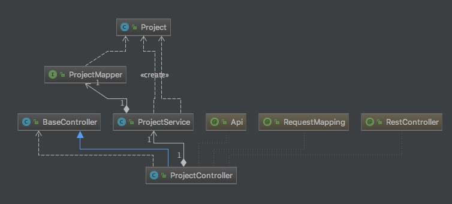
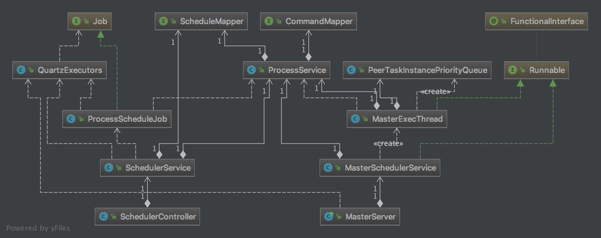

## 集群版 安装参考官网:
https://dolphinscheduler.apache.org/zh-cn/docs/1.3.6/user_doc/cluster-deployment.html

## 安装后 使用操作参考:
https://www.bbsmax.com/A/n2d9q3DodD/

## 代码走读
- 官网基本数据流向图:
https://dolphinscheduler.apache.org/img/process-start-flow-1.3.0.png

###  Api Server

#### 读取view 显示方向
- 具体流程UML类图如下:

- 上图的流程还是比较常规的流程:Controller -> Service -> Mapper -> SQL Entity 结果返回封装等等。

### Master Server

- 主要核心流程UML类图如下:

1. 保存scheduler流程这边比较简单:由SchedulerController -> SchedulerService -> SchedulerMapper 进行t_ds_schedules表的保存；
2. 读取scheduler方向，主要是由MasterServer启动的QuartzExecutors，会根据ProcessScheduleJob里面的excute方法，调取ProcessService写入数据，
通过CommandMapper，写入t_ds_command表，具体命令信息；
3. 扫描任务流程方向，主要是由MasterServer启动的启动的MasterSchedulerThread(MasterSchedulerService类)，获取到ZK锁之后；
调取ProcessService的findOneCommand方法不断获取待处理的command，然后通过其handleCommand方法进行实例化ProcessInstance；
实例化流程后，传入MasterExecThread进行DAG拆解，最后可以运行的任务信息加入PeerTaskInstancePriorityQueue的优先级队列:readyToSubmitTaskQueue。

### Worker Server

通过TaskExecuteProcessor 获取任务将TaskExecuteThread加入到线程池执行。

